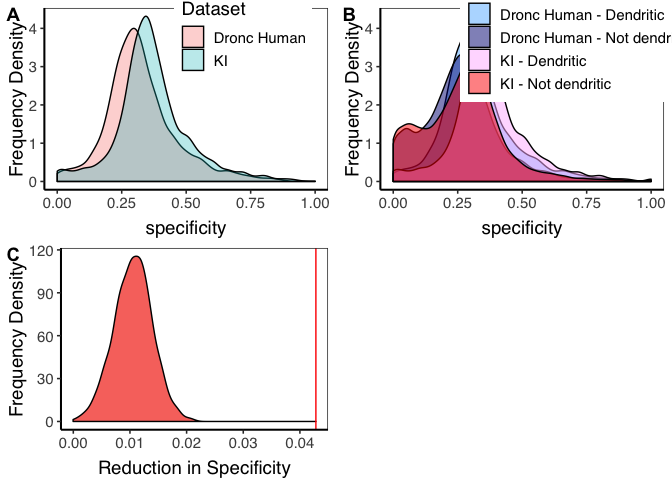
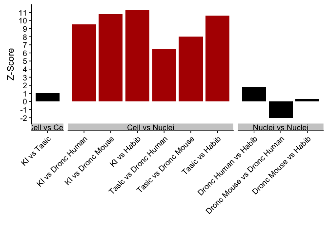

Dendritic Enrichment
================
Nathan Gerald Skene
2019-03-22

-   [Introduction](#introduction)
-   [Installation](#installation)
-   [Now load required packages](#now-load-required-packages)
-   [Basic use of the compare.dataset function](#basic-use-of-the-compare.dataset-function)
-   [Generate the standard dendritic enrichment plot used in publications](#generate-the-standard-dendritic-enrichment-plot-used-in-publications)
-   [Citation](#citation)

<!-- Readme.md is generated from Readme.Rmd. Please edit that file -->
Introduction
------------

This R package contains code used for testing for differences in dendritic depletion between single cell/nuclei datasets. It's primary purpose is to demonstrate that nuclei datasets are systematically depleted of neuronally relevant transcripts. It also acts as a quality metric for comparing datasets. The method was described in our 2018 Nature Genetics paper, *"Genetic identification of brain cell types underlying schizophrenia"*.

Installation
------------

This package depends on a couple of other R packages also available through github.

    install.packages("devtools")
    library(devtools)
    install_github("nathanskene/ewce")
    install_github("nathanskene/MAGMA_Celltyping")
    install_github("nathanskene/DendriticEnrichmentPackage")

If you have got any issues using the package then please do file an issue on github (and email me if I don't respond promptly).

Now load required packages
==========================

    library(dplyr)
    library(ggplot2)
    library(cowplot)
    library(MAGMA.Celltyping)
    library(DendriticEnrichmentPackage)

Basic use of the compare.dataset function
=========================================

The package depends on being able to compare a set of cells that are common across datasets. I generally use astrocytes, interneurons, microglia, oligodendrocytes, pyramidal neurons and OPCs. The specificity metric is then calculated for just these cell types. The specificity values for dendritic enriched transcripts () are then compared.

The code below

``` r
# LOAD KI MOUSE (using pyramidal SS)
keepCells = c("astrocytes_ependymal","interneurons","microglia","Oligodendrocytes","pyramidal SS","Oligodendrocyte Precursor")
mouseSS_dist = prepare_specificity_comparison_across_datasets(MAGMA.Celltyping::ctd_allKI,keepCells,species="mouse",datasetName="KI",useCell="pyramidal SS",sharedName="Pyramidal Neuron",datasetGroup="Cell")

# LOAD TASIC
keepCells = c("Astrocytes","Interneurons","Microglia","Oligodendrocytes","Pyramidal Neurons","Oligodendrocyte Precursor Cell")
tasic_mouse_dist = prepare_specificity_comparison_across_datasets(MAGMA.Celltyping::ctd_Tasic,keepCells,species="mouse",datasetName="Tasic",useCell="Pyramidal Neurons",sharedName="Pyramidal Neuron",datasetGroup="Cell")

# LOAD DRONCSEQ-Mouse
keepCells = c("ASC","exCA","GABA","MG","OPC","ODC")
dronc_mouse_dist = prepare_specificity_comparison_across_datasets(MAGMA.Celltyping::ctd_DRONC_mouse,keepCells,species="mouse",datasetName="Dronc Mouse",useCell="exCA",sharedName="Pyramidal Neuron",datasetGroup="Nuclei")

# LOAD DRONCSEQ-Human
keepCells = c("ASC","exCA","GABA","MG","OPC","ODC")
dronc_human_dist = prepare_specificity_comparison_across_datasets(MAGMA.Celltyping::ctd_DRONC_human,keepCells,species="human",datasetName="Dronc Human",useCell="exCA",sharedName="Pyramidal Neuron",datasetGroup="Nuclei")

# LOAD DIVSEQ
keepCells = c("Astrocytes","Hippocampal Interneuron","Microglia","Oligodendrocytes","Hippocampal CA1 Pyramidal Neuron","Oligodendrocyte Precursor")
divseq_dist = prepare_specificity_comparison_across_datasets(MAGMA.Celltyping::ctd_DivSeq,keepCells,species="mouse",datasetName="Habib",useCell="Hippocampal CA1 Pyramidal Neuron",sharedName="Pyramidal Neuron",datasetGroup="Nuclei")
```

A basic comparison between two datasets is done as follows:

``` r
a = compare_datasets(dataset1=mouseSS_dist,dataset2=dronc_human_dist, geneListHGNC=dendriticGenesHGNC,orthologs=orthologs,sharedName="Pyramidal Neuron")
plot_grid(a$hist_plot, a$comb_hist_plot, a$boot_plot, labels = c("A", "B", "C"), align = "h")
```



Generate the standard dendritic enrichment plot used in publications
====================================================================

``` r
allDataSets = list(mouseSS_dist,tasic_mouse_dist,dronc_mouse_dist,dronc_human_dist,divseq_dist)

res = test_all_comparisons(allDataSets,orthologs,sharedName="Pyramidal Neuron")

thePlot = generate_publication_plot_for_single_list(res)

print(thePlot)
```



Citation
========

If you use this software then please cite

[Skene, et al. Genetic identification of brain cell types underlying schizophrenia. Nature Genetics, 2018.](https://www.nature.com/articles/s41588-018-0129-5)

The package uses the dendritic enriched transcripts from the following paper, which should also be cited:

[Cajigas, et al. The Local Transcriptome in the Synaptic Neuropil Revealed by Deep Sequencing and High-Resolution Imaging. Neuron, 2012.](https://www.sciencedirect.com/science/article/pii/S0896627312002863)
